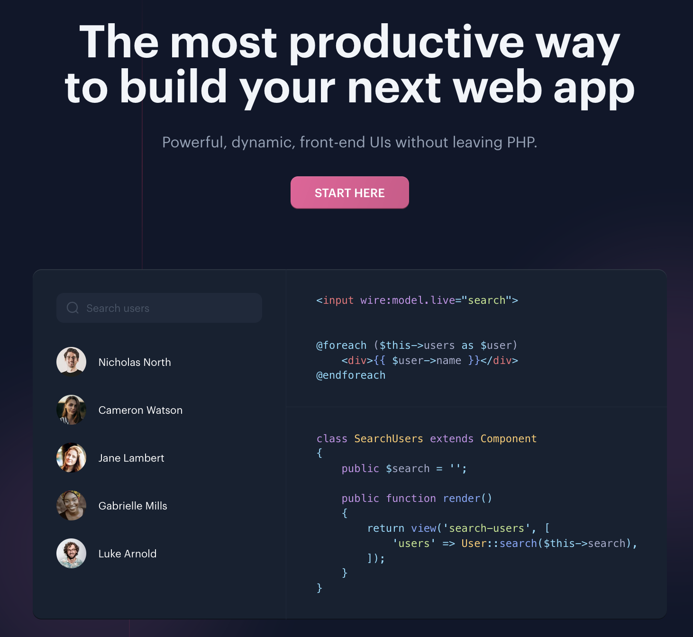
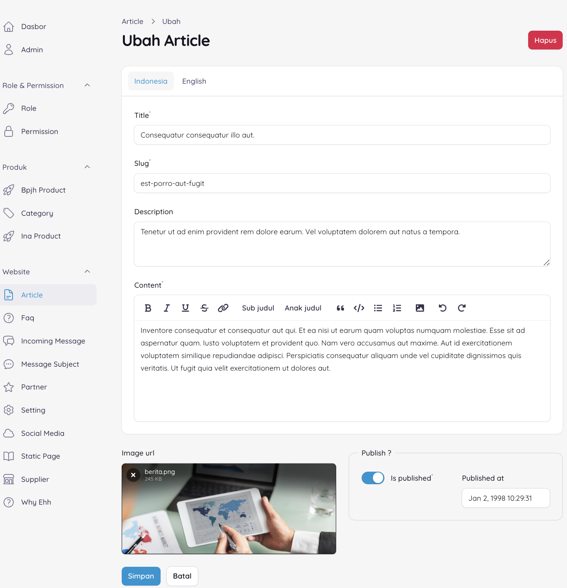
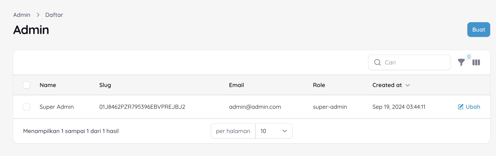
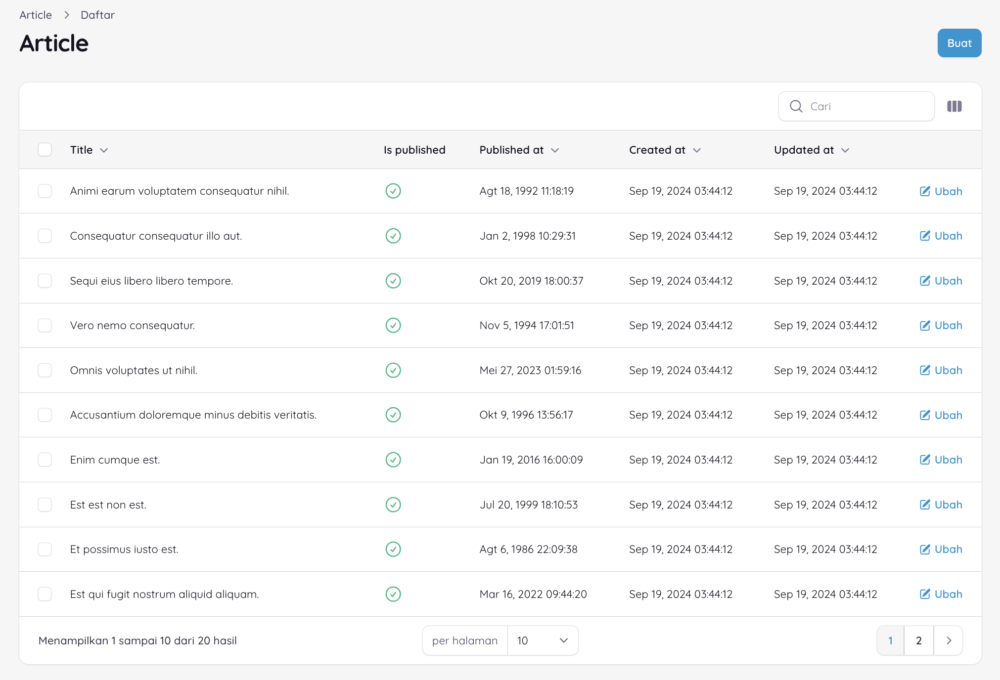
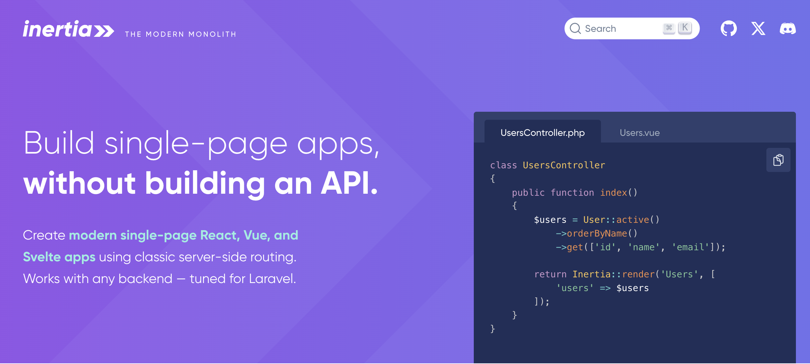
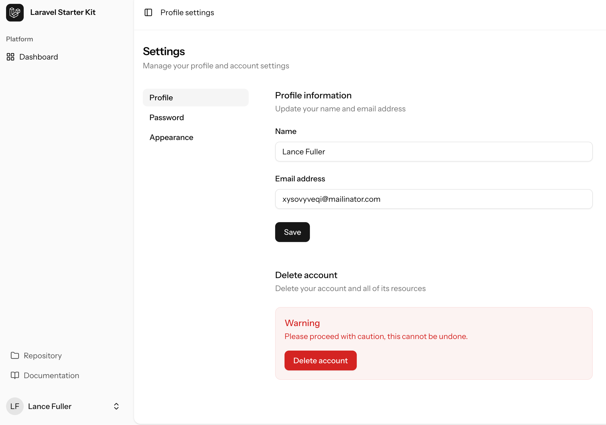
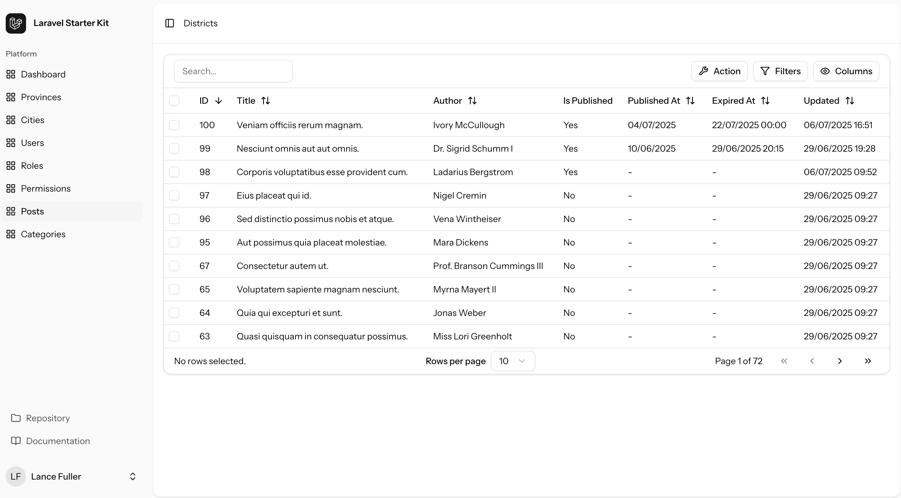
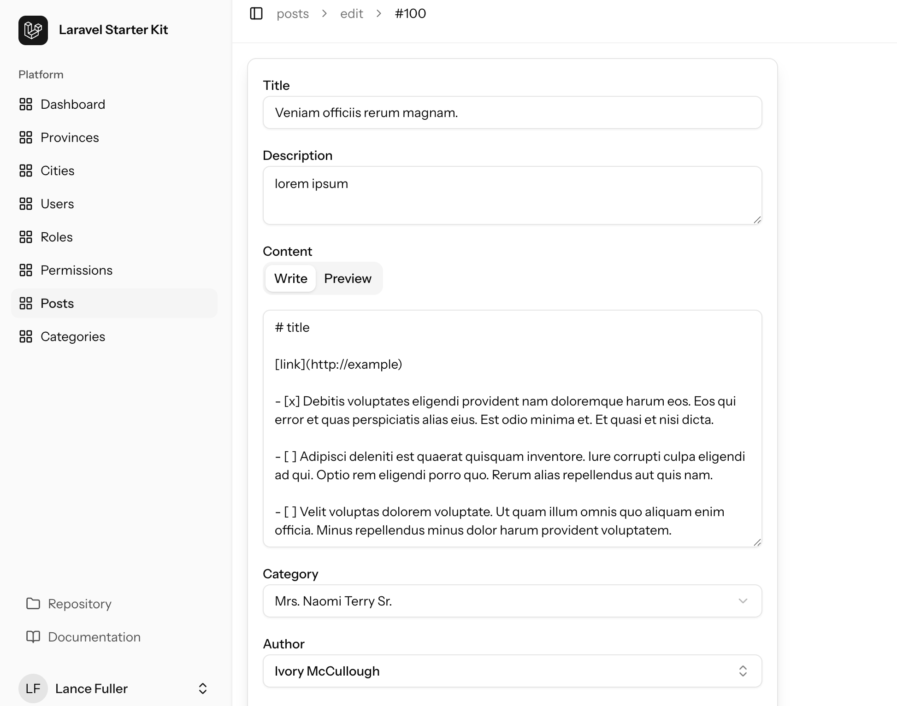
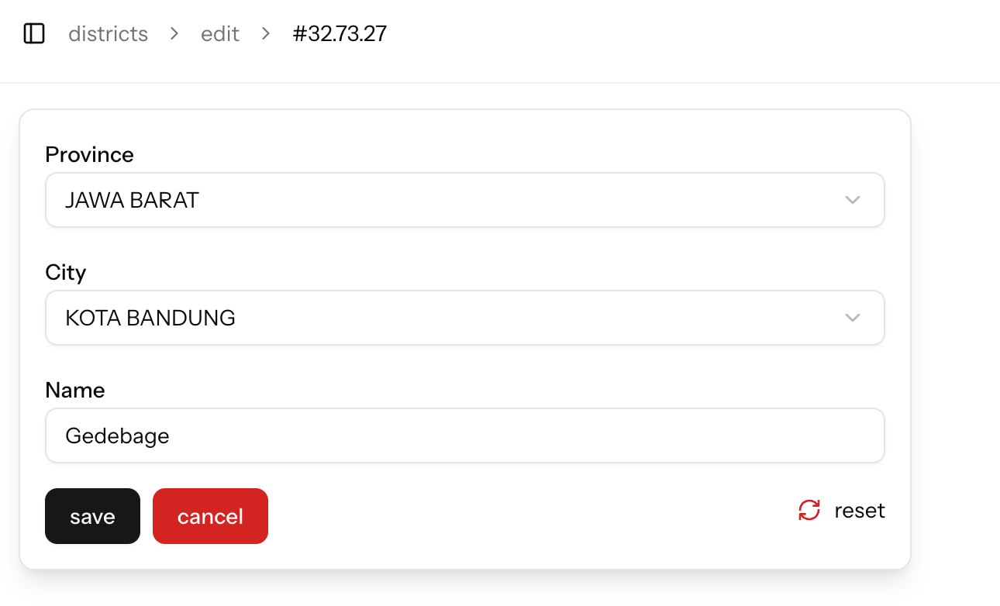

# The Modern Laravel Stack & The Backend-Driven Approach

---
layout: image-right 
image: /kit.png 
backgroundSize: cover
---

# The Modern Laravel Stack

A quick look at the tools that shape modern Laravel development.

- [Livewire](https://laravel.com/docs/12.x/starter-kits#livewire)
- [Inertia React](https://laravel.com/docs/12.x/starter-kits#react)
- [Inertia Vue](https://laravel.com/docs/12.x/starter-kits#vue)

---
layout: split
---

::left::

# Livewire

[Livewire](https://livewire.laravel.com) is a package for Laravel that allows
you to build dynamic interfaces using PHP, similar to
[Ruby's Hotwire](https://hotwired.dev).



::right::

## **How it works:**

You write PHP classes (called components) that render Blade templates. User
interactions trigger AJAX requests back to the server, which re-renders the
component and sends the updated HTML back to the client.

- Return HTML from AJAX requests
- Doesn't replace javascript, but abstracts the javascript
- No new syntax, Using blade templating and has new directive (wire:model or
  wire:click)
- Distinct separation server code (livewire) and client code (javascript or
  [alpinejs](https://alpinejs.dev))

---
layout: split
---

::left::

# FilamentPHP

- [Filament](https://filamentphp.com) is a Server-Driven UI framework for
  Laravel.
- Define UI entirely in PHP using structured objects.
- Built on Livewire, Alpine.js, Tailwind CSS.


### What is Server-Driven UI?

- SDUI is a proven architecture used by Meta, Airbnb, Shopify.
- Server controls UI, allows faster iteration & centralized logic.

::right::

# Why it was created?

- To rapidly build beautiful admin panels and forms.
- Provides a pre-built architecture for common application UIs.

# The Approach

It follows a **backend-driven** or **declarative** approach.

1. You define the entire structure of your UI (forms, fields, table columns,
   actions) in PHP classes.
2. Filament then takes care of rendering the corresponding Blade and Livewire
   components on the frontend.
3. You build complex interfaces without touching frontend code.

---
layout: full
---

# Declarative Approach

## Flutter

<div class="flex items-center gap-4">
    
    
</div>

```dart
children: [
    Column(
    mainAxisAlignment: MainAxisAlignment.start,
    crossAxisAlignment: CrossAxisAlignment.start,
    children: [
        Container(height: 80),
        Text(
            'Hello World',
            textAlign: TextAlign.center,
            style: TextStyle(
                fontSize: 24,
                fontWeight: FontWeight.bold,
                color: Colors.white,
                fontFamily: GoogleFonts.quicksand().fontFamily,
            ),
        ),
    ...
```

---
layout: split
---

::left::

# Example

the form builder code generate this form UI



::right::

# Form Builder

declarative syntax

```php
Forms\Components\Tabs\Tab::make('Indonesia')
    ->schema([
        Forms\Components\TextInput::make('title.id')
            ->label('Title')
            ->lazy()
            ->afterStateUpdated(
                fn (Forms\Set $set, ?string $state) => $set(
                    'slug.id',
                    Str::slug($state)
                )
            )
            ->required(),
        Forms\Components\TextInput::make('slug.id')
            ->label('Slug')
            ->required(),
        Forms\Components\Textarea::make('description.id')
            ->label('Description')
            ->rows(3),
        Forms\Components\RichEditor::make('content.id')
            ->label('Content')
            ->required()
            ->maxLength(65535),
])
```

---
layout: split
---

::left::

# Example

the table builder code generate this table UI





::right::

# Table Builder

declarative syntax

```php
return $table
    ->columns([
        Tables\Columns\TextColumn::make('title')
            ->searchable()
            ->sortable(),
        Tables\Columns\IconColumn::make('is_published')->boolean(),
        Tables\Columns\TextColumn::make('published_at')
            ->dateTime()
            ->sortable()
            ->toggleable(isToggledHiddenByDefault: false),
    ])
    ->filters([
        SelectFilter::make('is_published')
            ->options([
                true => 'Yes',
                false => 'No',
            ])
    ])
    ->actions([Tables\Actions\EditAction::make()])
    ->bulkActions([
        Tables\Actions\BulkActionGroup::make([
            Tables\Actions\DeleteBulkAction::make(),
        ]),
    ]);
```

---
layout: image
image: /filament3.png
backgroundSize: contain
---

---
layout: split
---

::left::

# Inertia

[Inertia](https://inertiajs.com) is a new approach to building classic server-driven web apps. We call it the modern monolith.
A tool that connects a server-side framework (like Laravel) to a client-side
framework (like React, Vue, or Svelte) without the complexity of building a full
API.



::right::

# How it works

You build standard Laravel controllers that return Inertia responses. These
responses include the page component name and its data (props). Inertia then
dynamically loads the correct frontend component without a full page reload.

**Use Case:**

Perfect for building modern Single-Page Applications (SPAs) with the power of a
client-side framework, but with the routing and data management handled by
server side framework (like Laravel).

```php
public function show(Permission $permission): Response
{
    return Inertia::render('permissions/show', [
        'permission' => $permission,
        'routeName' => 'permissions',
        'routeId' => $permission->id,
    ]);
}
```

---
layout: image-right 
image: /kit.png 
backgroundSize: cover
---

# Laravel starter kit.

- [Inertia React](https://laravel.com/docs/12.x/starter-kits#react)
- [Inertia Vue](https://laravel.com/docs/12.x/starter-kits#vue)



---
layout: split
---

::left::

# Inertia Builder

A package to build inertia react/vue ui with backend driven approach.

Directly inspired by FilamentPHP's powerful and efficient backend-driven
approach.

- **Declarative UI Construction:** Define forms and data tables in your Laravel
  controllers.
- **Rich Form Fields:** A wide variety of form fields available out-of-the-box.
- **Powerful Data Tables:** Create complex data tables with searching,
  filtering, sorting, and actions.
- **Reactive Components:** Create dependent dropdowns and other reactive form
  elements.
- **Relationship Handling:** Automatically populate fields and table columns
  from Eloquent relationships.
- **Customizable:** Extend the library with your own custom fields and filters.

::right::

# Core Concept: Backend-Driven UI

The structure of the UI (e.g., form fields, table columns) is defined in PHP
controller classes, and a generic set of React components renders the final UI.

# Requirement

- PHP >= 8.4
- Laravel >= 12
- Nodejs & npm >= 20
- Tailwind 4
- Laravel
  [official starter kit with React](https://laravel.com/docs/12.x/starter-kits#react)

currently not supported for `official vue starter kit`

---
layout: split
---

::left::

# Datatable Example

Define your entire data table in the `index` method of your controller.



::right::

```php
// PostController.php
public function index(): Response
{
    $table = Table::make(Post::class)
        ->columns([
            TableColumn::make('id')->sortable(),
            TableColumn::make('title')->searchable()->sortable(),
            TableColumn::make('author.name')->label('Author')->searchable(),
            TableColumn::make('published')->renderUsing(fn ($value) => $value ? 'Yes' : 'No'),
            TableColumn::make('published_at')->sortable(),
        ])
        ->filters([
            Filter::text('title'),
            Filter::select('author.name')->label('Author')
                ->relationship(User::class, 'name', 'name'),
            Filter::date('published_at'),
        ])
        ->defaultSort('id', 'desc')
        ->actions([
            Action::make('new')->needRowSelected(false),
            Action::make('delete')->message('Delete this post?'),
        ]);

    return Inertia::render('builder/index', [
        'data' => $table,
        'routeName' => 'posts',
    ]);
}
```

---
layout: split
---

::left::

# Form Example

Define the fields for your create/edit forms in a reusable private method.



::right::

```php
// PostController.php
private function getFormFields(?Post $post = null): array
{
    return [
        Field::text('title')
            ->defaultValue($post?->title),
        Field::textarea('description')
            ->defaultValue($post?->description),
        Field::markdown('content')
            ->defaultValue($post?->content),
        Field::select('category_id')
            ->label('Category')
            ->relationship(Category::class, 'name'),
        Field::select('author_id')
            ->label('Author')
            ->searchable()
            ->relationship(User::class, 'name'),
        Field::toggle('published')
            ->label('Published ?'),
        Field::flatpickr('published_at')
            ->date(),
        Field::tags('tags')
            ->defaultValue($post?->tags),
        Field::file('thumbnail')
            ->defaultValue($post?->thumbnail),
    ];
}
```

---
layout: split
---

::left::

# Dependent Dropdowns Example

Here is how to set up a dependent dropdown for `City` based on the selected
`Province`.



::right::

```php
private function getFormFields(?Subdistrict $s = null): array
{
    $provinceId = request()->input('province_id') ?: $s?->district?->city?->province_id;

    return [
        Field::select('province_id')
            ->label('Province')
            ->relationship(Province::class, 'name')
            ->reactive() // Mark as reactive
            ->defaultValue($provinceId),

        Field::select('city_id')
            ->label('City')
            ->placeholder('Select Province first')
            ->relationship(City::class, 'name')
            // Depends on 'province_id'
            ->dependsOn('province_id', 'province_id', $provinceId)
            ->defaultValue($cityId),
    ];
}
```

---
layout: split
---

::left::

# Getting Started

### 1. Install Package

```bash
composer require jhonoryza/laravel-inertia-builder
php artisan inertia-builder:install
```

### 2. Add Toaster Component

`resources/js/layouts/app.layout.tsx`

```tsx
import { Toaster } from "@/components/ui/sonner";

<AppLayoutTemplate {...props}>
    <Toaster />
    {children}
</AppLayoutTemplate>;
```

::right::

### 3. Configure Middleware

`app/Http/Middleware/HandleInertiaRequests.php`

```php
public function share(Request $request): array
{
    return [
        // ...
        'flash' => [
            'success' => fn() => $request->session()->get('success'),
            'error' => fn() => $this->getErrMessage($request),
            'description' => fn() => $request->session()->get('description'),
        ],
    ];
}

private function getErrMessage(Request $request): string
{
    /** @var ViewErrorBag $errors */
    $errors = $request->session()->get('errors');
    if ($errors) {
        return collect($errors->getMessages())->flatten()->implode(', ');
    }
    return '';
}
```

---
layout: split
---

::left::

# Generator Scaffolding

Generate Model, Factory, Controller, Request, and Routes from reading a database table.

```bash
# Example for a 'posts' table
php artisan inertia-builder:generate posts
```

Then recompile the frontend:

```bash
npm run dev
```

---
layout: full
---

# Summary

| Stack    | Declarative syntax & Backend driven | Free | React | Vue | Blade | Features                           | Style    |
| -------- | ----------------------------------- | ---- | ----- | --- | ----- | ---------------------------------- | -------- |
| Livewire | FilamentPHP                         | Yes  | No    | No  | Yes   | Table, Form, Panel, Action, Widget | Tailwind |
| Inertia  | Inertia UI                          | No   | Yes   | Yes | No    | Table, Modal                       | Tailwind |
| Inertia  | Inertia Builder                     | Yes? | Yes   | No  | No    | Table, Form                        | Tailwind |

---
layout: 'intro'
---

# Thank You!

Q&A

jardik.oryza@gmail.com
